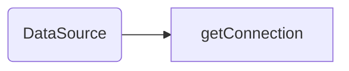
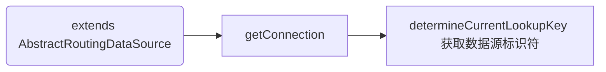

原始 DataSource 方式多数据源切换
* 继承原始 DataSource 实现方式

```mermaid
graph LR
    source(DataSource)
    func[getConnection]


source-->func
```
* 继承 Spring AbstractRoutingDataSource 路由数据源方式

```mermaid
graph LR
    source(extends AbstractRoutingDataSource)
    getKey[determineCurrentLookupKey 获取数据源标识符]
    func[getConnection]
    
source-->func
func-->getKey
```
* 基于原始 DataSource 的 AOP 自定义注解数据库切换方式